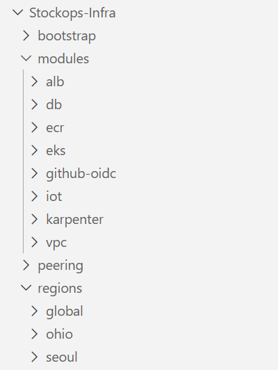
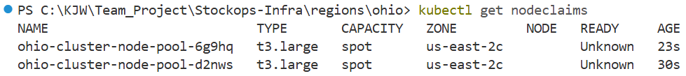
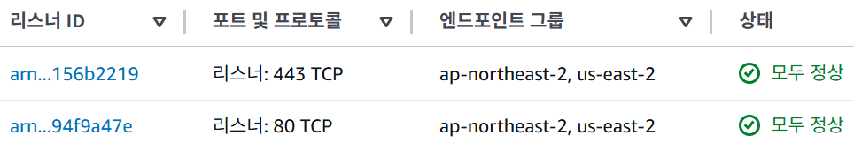

# StockOps — 식품 ERP 멀티 리전 클라우드 인프라


> **팀명**: 시선 (SysSun — System Surveillance & Unified Network)  
> **주제**: AX 환경을 위한 ERP 솔루션 기반 멀티 하이브리드 클라우드 인프라 자동화 및 Observability 체계 구축

K-Food 수출 기업(예: 비비고 만두)을 모델로 한 ERP/WMS 솔루션 StockOps의 AWS 멀티 리전 인프라 레포입니다. 서울 본사와 미국 오하이오 영업팀이 독립적인 리전에서 동작하며, Terraform IaC로 전체 인프라를 코드로 관리합니다.

> **도메인**: `siseon.live`  
> 정적 프론트(client/admin)는 **CloudFront + S3**, 동적 API/WS/AI는 **Global Accelerator → ALB → EKS** 의 공존 구조로 분리되어 있습니다.

---

## 👤 담당 범위

4인 팀 프로젝트 **StockOps**(팀명 시선) 중 **인프라 파트**를 담당했습니다. 이 레포와 [Stockops-GitOps](https://github.com/jinuuuKim/Stockops-GitOps)가 담당 산출물입니다.

| 영역 | 내용 |
|------|------|
| **IaC** | Terraform 전체 — VPC·EKS·RDS·ALB·ECR·IoT·Karpenter 모듈 8종 및 리전별 구성 |
| **State 설계** | 리전·계층 기준 4분리(`seoul`/`ohio`/`peering`/`global`) + 적용 순서 규칙화 |
| **네트워크** | VPC 3-Tier · 서울↔오하이오 피어링 · Global Accelerator 지연 라우팅 |
| **오토스케일링** | HPA(파드) + Karpenter(노드) 2단 구성, spot 우선 |
| **CI/CD** | GitHub Actions(OIDC 키리스) + ArgoCD GitOps |
| **보안** | GitHub OIDC·IRSA(정적 키 0개) · Secrets Manager+ESO · WAF 2계층 · SG 최소권한 |

---

## 📊 실측 수치

| 항목 | 값 |
|------|-----|
| IaC 커버리지 | Terraform 모듈 **8종** · State **4분리** — 전체 destroy 후 재apply 시 동일 구성 재현 확인 |
| 운영 파드 | **5개 → 3개 (40% 감축)** — 프론트엔드를 S3+CloudFront로 오프로딩 |
| 인증 | GitHub OIDC + IRSA — **정적 액세스 키 0개** |
| 멀티 리전 | EKS **2개**(서울·오하이오) + Global Accelerator 지연 라우팅 · RDS Cross-Region Replica |
| 오토스케일 | HPA(파드 1~4) + Karpenter(노드) 2단, spot 우선 |

---

## 🖥️ 실행 화면



> 재사용 모듈 8종(`modules/`)과 **리전·계층별로 분리된 실행 단위**. `peering`을 `regions`와 같은 층에 둔 것이 핵심으로, 서울/오하이오 어느 쪽을 다시 적용해도 피어링이 독립적으로 유지됩니다.



> 부하가 몰리자 Karpenter가 **t3.large spot 노드 2대를 30초 이내에 자동 프로비저닝**하는 순간(`kubectl get nodeclaims`). HPA가 파드를 늘리고 → 배치할 자리가 부족하면 Karpenter가 노드를 띄우는 2단 구조입니다.



> Global Accelerator 리스너(443/80)에 **서울·오하이오 두 리전이 모두 엔드포인트로 등록되어 정상 상태**. 지연 기반으로 한국→서울, 미국→오하이오로 라우팅되며 리전 장애 시 자동 페일오버합니다.

---

## 🔑 설계 판단

### 1. State를 왜 4개로 나눴나 — 그리고 나눠서 생긴 문제

리전 하나를 손볼 때마다 전체 인프라가 잠기는 걸 막으려고 **리전·계층 기준으로 상태 파일을 나눴습니다**(`seoul`/`ohio`/`peering`/`global`).

**그런데 분리 자체가 답은 아니었습니다.** 한쪽 리전을 다시 적용하면 리전 VPC 모듈이 라우팅 테이블을 통째로 덮어써 **다른 쪽 피어링 경로가 사라지는 문제**가 생겼습니다. 상태를 나눈다고 리소스 간 의존성까지 사라지는 게 아니었던 겁니다.

- **적용 순서를 규칙으로 못 박고** 문서화 — `seoul → ohio → peering → global` (destroy는 역순)
- **리소스 참조에서 하드코딩을 제거** — `terraform_remote_state`로 상대 state의 출력값을 읽어오도록 변경
- 전체 destroy 후 재apply해 **동일 구성이 재현되는 것까지 확인**

### 2. HPA와 Karpenter를 왜 둘 다

층이 다르기 때문입니다. **HPA는 파드 수**를, **Karpenter는 그 파드를 올릴 노드**를 담당합니다. HPA만 있으면 파드가 늘어도 배치할 자리가 없어 `Pending`에 멈추고, Karpenter만 있으면 부하에 따른 파드 증감이 안 됩니다.

> ⚠️ 초기에 Karpenter가 노드를 못 띄우는 문제가 있었는데, 원인은 `SecurityGroupSelectorTerms`가 참조하는 태그가 클러스터 보안 그룹에 누락된 것이었습니다. `aws_ec2_tag`로 태그를 보강해 해결했습니다. (`modules/eks/main.tf`)

### 3. 왜 정적 액세스 키를 하나도 만들지 않았나

키는 만드는 순간 관리 대상이 되고, 유출되면 회수 전까지 계속 유효합니다. **CI는 GitHub OIDC로, 파드는 IRSA로** 필요한 순간에만 임시 자격증명을 발급받도록 구성해 **장기 자격증명을 아예 만들지 않았습니다**. 시크릿도 매니페스트에 넣지 않고 Secrets Manager + ESO로 클러스터가 직접 가져가게 했습니다.

---

## 레포 구성

| 레포 | 설명 |
|------|------|
| **[Stockops-Infra](https://github.com/jinuuuKim/Stockops-Infra)** | Terraform IaC — 현재 레포 |
| **[Stockops-Application](https://github.com/jinuuuKim/Stockops-Application)** | 앱 모노레포 (api-server, ai-module, client-web, admin-web, sensimul) + GitHub Actions CI/CD |
| **[Stockops-GitOps](https://github.com/jinuuuKim/Stockops-GitOps)** | ArgoCD용 K8s manifest (Kustomize 기반, 서울/오하이오 overlay 분리) |

---

## 시나리오

| 환경 | 역할 |
|------|------|
| AWS 서울 (`ap-northeast-2`) | 본사. 한국 사용자 대상 메인 서비스 (풀스택) |
| AWS 오하이오 (`us-east-2`) | 미국 영업팀 대상 서비스 (멀티 리전 풀스택 미러) |
| 온프레미스 (한국) | 물류 센터·창고. MQTT 센서 데이터 수집 |

- **데이터**: Multi-AZ(1차) + Cross-Region Read Replica(2차) 3단계 방어
- **트래픽**: 정적은 CloudFront 엣지 캐시, 동적은 Global Accelerator 지연 기반 라우팅 (한국→서울, 미국→오하이오) + 리전 장애 시 자동 페일오버
- **보안**: 미국 영업팀은 최소 권한으로 앱·DB 접근, S3는 OAC 전용 (퍼블릭 차단)

---

## 아키텍처

```
        [한국 사용자]                          [미국 사용자]
              │                                      │
   ┌──────────┴──────────┐              ┌────────────┴──────────┐
   │ 정적                │ 동적          │ 동적                  │ 정적
   ▼                     ▼              ▼                       ▼
siseon.live /         api.siseon.live                       (동일)
app.siseon.live              │
   │                         ▼
   ▼                Global Accelerator
CloudFront            (지연 라우팅 + 페일오버)
(OAC, 엣지캐시)            │         │
   │              ┌────────┘         └────────┐
   ▼              ▼                            ▼
  S3          서울 ALB                    오하이오 ALB
(정적 자산)    (HTTPS 443)                (HTTPS 443)
            /api /ws → api-server       /api /ws → api-server
            /ai      → ai-module        /ai      → ai-module
            default  → 404             default  → 404
                 │                           │
             서울 EKS                    오하이오 EKS
          (api / ai / redis)           (api / ai / redis)
                 │                           │
          서울 RDS (Primary) ─────────→ 오하이오 RDS (Read Replica)
```

- **정적 (`siseon.live`, `app.siseon.live`)**: CloudFront → S3(OAC). SPA 라우팅은 403/404 → `index.html` 폴백.
- **동적 (`api.siseon.live`)**: CloudFront 없이 GA 직접 → 실제 클라이언트 IP 기반 지연 라우팅 유지.
- 서울 장애 시: 한국 트래픽도 오하이오로 페일오버 + RDS Promote.

---

## 애플리케이션 컴포넌트

| 컴포넌트 | 기술 | 포트 | 서빙 경로 |
|----------|------|------|-----------|
| client-web | React + Vite | — | `siseon.live` → CloudFront → S3 |
| admin-web | React + Vite | — | `app.siseon.live` → CloudFront → S3 |
| api-server | Spring Boot 3.2 / Java 21 | 8080 | `api.siseon.live` → GA → ALB (`/api/*`, `/ws/*`) |
| ai-module | FastAPI | 8000 | `api.siseon.live` → GA → ALB (`/ai/*`) |
| sensimul | Go 1.23+ | — | 온프레미스 IoT 센서 시뮬레이터 |

---

## 인프라 디렉토리 구조

```
Stockops-Infra/
├── modules/          # 재사용 모듈 (vpc, alb, eks, db, ecr, github-oidc, iot, karpenter)
├── regions/
│   ├── seoul/        # 서울 리전 — VPC·EKS·RDS·IoT + Route53 호스팅 존 + ACM(ALB용)
│   ├── ohio/         # 오하이오 리전 — VPC·EKS·RDS(Replica) + ACM(ALB용)
│   └── global/       # Global Accelerator · Route53 A 레코드 · CloudFront/S3(OAC) · ACM(us-east-1)
├── peering/          # Seoul ↔ Ohio VPC 피어링 (remote_state로 VPC ID·RT ID 참조, 하드코딩 없음)
└── bootstrap/        # S3 backend 버킷 + KMS 키 초기 생성
```

### Terraform State 구조 (S3 backend)

```
siseon-terraform-state/
└── infra/
    ├── seoul/terraform.tfstate     # Route53 호스팅 존 소유
    ├── ohio/terraform.tfstate
    ├── peering/terraform.tfstate   # VPC Peering + 양방향 Route
    └── global/terraform.tfstate
```

### DNS / 인증서 관리

```
regions/seoul/   → Route53 호스팅 존 + ACM (ap-northeast-2, ALB HTTPS용)
regions/ohio/    → ACM (us-east-2, ALB HTTPS용)
regions/global/  → ACM (us-east-1, *.siseon.live, CloudFront 전용)
                   Route53 A 레코드:
                     siseon.live     → CloudFront (client)
                     app.siseon.live → CloudFront (admin)
                     api.siseon.live → Global Accelerator
```

> Route53 호스팅 존은 서울 state가 소유. 오하이오/글로벌은 `terraform_remote_state`로 zone_id 참조.  
> 도메인 NS는 등록기관(가비아)에서 Route53 위임 세트로 교체.

---

## 배포된 AWS 리소스

| 리소스 | 서울 | 오하이오 | 글로벌 |
|--------|------|----------|--------|
| VPC | 10.0.0.0/16 | 10.1.0.0/16 | — |
| EKS | seoul-cluster v1.30 | ohio-cluster v1.30 | — |
| 노드 오토스케일 | Karpenter + HPA | Karpenter + HPA | — |
| ALB | HTTPS + 경로 라우팅 | 동일 | — |
| RDS | PostgreSQL 18.4 (Primary) | Read Replica | — |
| ECR | stockops-api, stockops-ai | stockops-api, stockops-ai | — |
| ACM | siseon.live (ALB) | siseon.live (ALB) | *.siseon.live (CloudFront) |
| IoT Core + SQS + Firehose | ✅ | — | — |
| Secrets Manager + ESO | ✅ | ✅ | — |
| Route53 호스팅 존 | ✅ (소유) | — | A 레코드 |
| CloudFront + S3 (정적 프론트) | — | — | client / admin (OAC) |
| Global Accelerator | — | — | HTTP/HTTPS, 서울/오하이오 ALB 엔드포인트 |

---

## ALB 라우팅 규칙 (서울/오하이오 공통)

| Priority | 조건 | 대상 |
|----------|------|------|
| 5 | `/ws`, `/ws/*` | api-server (WebSocket / STOMP) |
| 10 | `/api`, `/api/*` | api-server |
| 20 | `/ai`, `/ai/*` | ai-module |
| default | 나머지 | fixed-response 404 |

> HTTP(80) → HTTPS(301) 리다이렉트.  
> GA는 `spring_tg`·`fastapi_tg` **모두 healthy** 여야 해당 ALB를 healthy로 판정합니다.

---

## IoT 센서 파이프라인

```
온프레미스 센서 (sensormqtt.ithans.com)
    └─ Mosquitto 브리지 (TLS:8883)
         └─ AWS IoT Core (sensimul/sites/+/sensors/+)
              └─ IoT Rule ─┬─→ SQS → api-server → Redis → 웹 실시간 표시 / WebSocket 푸시
                           └─→ Kinesis Firehose → S3 (GZIP, 날짜 파티션) → Athena 분석
```

- IoT Thing: `mosquitto-bridge`
- 서울 엔드포인트: `a2ie1b3xp2emgi-ats.iot.ap-northeast-2.amazonaws.com`
- 운영 센터: `CT-SEL / CT-ICN / CT-PUS / CT-DAE / CT-GWJ` — DOOR·온습도·공기질 센서 실시간 발행
- 센서 메시지 포맷: snake_case JSON (`site_id`, `sensor_id`, `sensor_type`, `value`, ...)
- `sensor_devices.mqtt_topic`에 등록된 토픽만 ingest됩니다 (`sensimul/sites/{site_id}/sensors/{sensor_id}` 형식).

---

## 시크릿 관리 (ESO)

```
Secrets Manager (stockops/app)
    └─ ClusterSecretStore
         └─ ExternalSecret (1h 주기 동기화)
              └─ K8s Secret (stockops-secret) 자동 생성
                   └─ 파드 환경변수 주입
```

> apply 직후 `kubectl get secret stockops-secret -n stockops`로 동기화 확인.

---

## CI/CD 흐름

```
GitHub Actions (Stockops-Application — main push)
├─ [정적] client-web / admin-web
│    └─ Vite 빌드 → S3 sync → CloudFront 캐시 무효화
│
└─ [동적] api-server / ai-module
     └─ 이미지 빌드 → 서울 ECR + 오하이오 ECR 직접 push (OIDC)
          └─ Stockops-GitOps kustomization.yaml 이미지 SHA 업데이트
               └─ ArgoCD 자동 감지 → 서울/오하이오 클러스터 각각 sync

ArgoCD — v7.7.0, 서울/오하이오 클러스터 독립 설치
  ├─ stockops-seoul → Stockops-GitOps/apps/stockops/seoul
  └─ stockops-ohio  → Stockops-GitOps/apps/stockops/ohio
```

> ECR은 리전별 독립 리포이며, CI가 양 리전에 직접 push합니다 (CRR 미사용 → 리전별 독립 롤백 가능).

---

## 배포 방법

### 사전 준비

```powershell
# AWS SSO 로그인
aws sso login --profile siseon

# 각 리전 디렉토리에 terraform.tfvars 생성
# 필요 변수: jwt_secret, db_username, db_password
```

### 전체 신규 구축

Apply 순서: `seoul → ohio → peering → global`

```powershell
# 1. Seoul
aws eks update-kubeconfig --region ap-northeast-2 --name seoul-cluster --profile siseon
terraform -chdir=regions/seoul apply -auto-approve

# 2. Ohio
aws eks update-kubeconfig --region us-east-2 --name ohio-cluster --profile siseon
terraform -chdir=regions/ohio apply -auto-approve

# 3. Peering (Seoul/Ohio VPC ID·RT ID를 remote state에서 자동 참조)
terraform -chdir=peering apply -auto-approve

# 4. Global (GA + Route53 A 레코드 + CloudFront/S3 + ACM)
terraform -chdir=regions/global apply -auto-approve

# 5. ArgoCD Application 등록 (EKS 신규 생성 시마다 필요)
kubectl apply -f Stockops-GitOps/argocd/stockops-seoul-application.yaml \
  --context arn:aws:eks:ap-northeast-2:448768137813:cluster/seoul-cluster
kubectl apply -f Stockops-GitOps/argocd/stockops-ohio-application.yaml \
  --context arn:aws:eks:us-east-2:448768137813:cluster/ohio-cluster
```

> Cross-Region RDS Replica 생성에 약 25분. ACM 검증은 NS 전파 후 자동 완료 (5~15분).

### Ohio만 재구축 (Seoul 유지 상태)

```powershell
terraform -chdir=regions/ohio apply -auto-approve
terraform -chdir=peering apply -auto-approve   # 새 Ohio VPC ID·RT ID 자동 감지
terraform -chdir=regions/global apply -auto-approve
```

### 검증

```powershell
kubectl get pods -n stockops

# CORS 확인
curl.exe -i -X OPTIONS https://api.siseon.live/api/v1/auth/login \
  -H "Origin: https://app.siseon.live" \
  -H "Access-Control-Request-Method: POST" | findstr /I "HTTP Access-Control"

# 타깃 그룹 헬스 (GA healthy 판정 전제)
foreach ($n in "seoul-spring-tg","seoul-fastapi-tg") {
  $tg = aws elbv2 describe-target-groups --names $n --region ap-northeast-2 --profile siseon `
    --query "TargetGroups[0].TargetGroupArn" --output text
  aws elbv2 describe-target-health --target-group-arn $tg --region ap-northeast-2 --profile siseon `
    --query "TargetHealthDescriptions[].TargetHealth.State" --output text
}
```

### 초기 로그인

- 이메일: `admin@stockops.com`
- 비밀번호: `admin123`

---

## 종료 (Destroy)

Destroy 순서: `global → peering → ohio → seoul`

> Peering state가 VPC Peering을 소유하므로 **Peering 먼저 destroy** 해야 Ohio VPC를 삭제할 수 있습니다.  
> Ohio RDS Replica가 Seoul RDS Primary를 참조하므로 **Ohio를 Seoul보다 먼저** destroy합니다.

```powershell
terraform -chdir=regions/global destroy -auto-approve
terraform -chdir=peering destroy -auto-approve
terraform -chdir=regions/ohio destroy -auto-approve
terraform -chdir=regions/seoul destroy -auto-approve
```

> 정적 S3 버킷은 `data` source 참조이므로 destroy해도 버킷·자산이 유지됩니다.

---

## ArgoCD 접근

ArgoCD는 `ClusterIP`로 운영됩니다. 포트포워딩으로 접근하세요.

```powershell
kubectl port-forward svc/argocd-server -n argocd 8080:443
# https://localhost:8080  /  admin  /  (초기 비밀번호 아래 명령으로 확인)
$b64 = kubectl -n argocd get secret argocd-initial-admin-secret -o jsonpath="{.data.password}"
[System.Text.Encoding]::UTF8.GetString([System.Convert]::FromBase64String($b64))
```

---

## 팀 클러스터 접근 (aws-auth)

팀원 4명은 IAM Identity Center(SSO) 권한셋 `AWSReservedSSO_AdministratorAccess`를 사용합니다.  
`regions/seoul/kubernetes.tf`의 `aws-auth` ConfigMap에 해당 권한셋 role ARN을 매핑하여 kubectl/ArgoCD 작업이 가능합니다.

---

자세한 아키텍처는 [ARCHITECTURE.md](ARCHITECTURE.md), AWS 리소스 목록은 [AWS_RESOURCES.md](AWS_RESOURCES.md)를 참고하세요.
